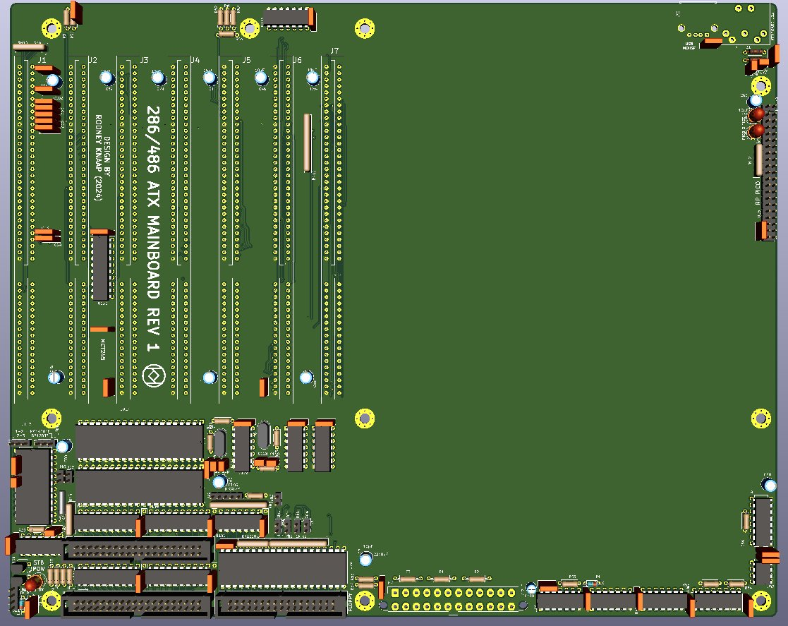
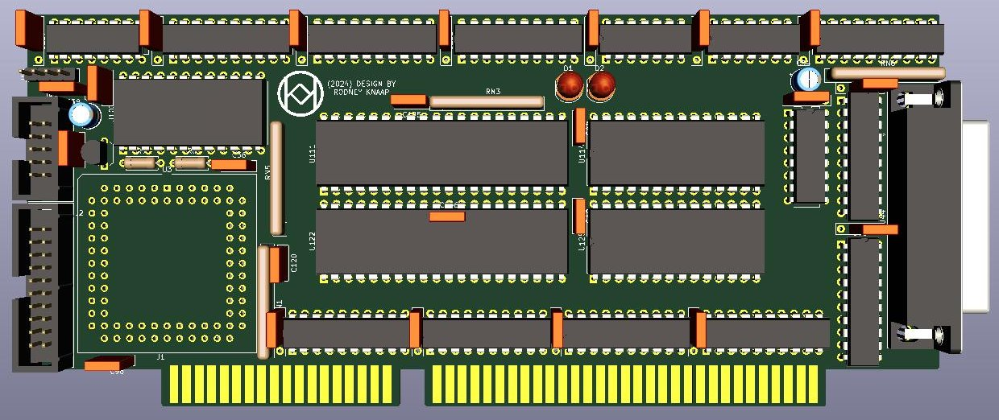

# atx-486at-mainboard
An ATX form factor 486 AT PC system based on technology from my previous 286 project

My aim is to preserve PC computing history, beyond the level of the physical existence of museum items, in a complete and open design, by recreating the original 286 and 486 AT PC system concepts in a known system design down to the full hardware component level details. This will enable the technology, even if no historic examples would exist anymore, to still be able to be kept alive in digital form here on GitHub. This project is different from what emulation offers, because inside this project, the actual original circuits and designs are kept alive and functionally intact, faithful to the original systems as these were created. 
So the system design is targeted to achieve the identical and original experience, same as if you would power up an original real PC from the 80s and 90s years. Of course, most of the 486 generation designs are hidden inside large scale integration ICs of completely unknown designs, so I will need to redesign much of the unknown elements with my own ideas and concepts to at least be able to approximate the functionality needed for this project. I already have done a lot of this type of work in the previous 286 project where for example I was successful to reproduce the functionality of the 82284 and 82288 controller chips. So in the final design version of that project, these chips are now successfully recreated in a known component level form, and thus no longer essential for the system to be functional. 

My aim is to reproduce the 286/486 system using as little unknown technology hidden inside ICs as possible, so that every aspect of the system can be completely and openly known and able to be studied by others. If anyone has some VHDL code or other idea which could contribute to replacing various typical integrated ICs in PC technology, such as DMA controllers, interrupt controllers, keyboard controller, timer, RTC/CMOS chip etc, please get in touch with me because I would prefer to replace these as well so that in future designs, these ICs would become unnecessary for the system to be able to function. The ultimate design goal is completely achieving an open concept, independent of any unknown custom logic, and only needing standard FPGA design components and VHDL level recreations needed.

## Purpose and permitted use, cautions for a potential builder of this design
This project was created for historical purposes out of love for historical computing designs and for the purpose of enabling computing enthousiasts with a sufficient level of building and troubleshooting expertise to be able to experience the technology by building and troubleshooting the hardware described in this project. 

Due to the level of this project, it may be suitable as a project for students to get into. If there are any questions from teachers who like to teach about this technology I would be happy to answer them. It may be really interesting to analyse the elaborate and complex CPU timing and 8 bit to 16 bit data byte translation and DMA mechanisms in an educational setting.

Besides the GPL3 license there are a few warnings and usage restrictions applicable: No guarantees of function or fitness for any particular or useful purpose is given, building and using this design is at the sole responsibility of the builder.

Do not attempt this project unless you have the necessary electronics assembly expertise and experience, and know how to observe all electronics safety guidelines which are applicable.

It is not permitted to use the computer built from this design without the assumption of the possibility of loss of data or malfunction of the connected device. To be used strictly for personal hobby and experimental purposes only. No applications are permitted where failure of the device could result in damage or injury of any kind.

If you plan to use this design or any part of it in new designs, the acknowledgement of the designer and the design sources and inspirations, historical and modern, of all subparts contained within this design should be included and respected in your publication, to accredit the hard work, time and effort dedicated by the people before you who contributed to make your project possible.

No guarantee for any proper operation or suitability for any possible use or purpose is given, using the resulting hardware from this design is purely educational and experimental and not intended for serious applications. Loss of data is likely and to be expected when connecting any storage device or storage media to the resulting system from this design, or when configuring or operating any storage device or media with the system of this design.

When connecting this system to a computer network which contains stored information on it, it is at the sole responsibility and risk of the person making the connection, no guarantee is given against data loss or data corruption, malfunctions or failure of the whole computer network and/or any information contained inside it on other devices and media which are connected to the same network.

When building this project, the builder assumes personal responsibility for troubleshooting it and using the necessary care and expertise to make it function properly as defined by the design. You can email me with questions, but I will reply only if I have time and if I find the question to be valid. Which will probably also lead to an update here. I want to primarily dedicate my time to new project development, I am not able to do any user support, so that's why I provide the elaborate info here which will be expanded if needed.

# Acknowledgements
I want to refer to the elaborate text on the 286 project repository to read all about the work, help and encouragements I got on my work recreating the 5170 based AT design.
Additional thanks specific to this project I will continue here, and in relevant sections of the project readme document as the themes arrive.

First of all, a special thank you to Luca (Retro*Tech) from Italy, who supported me with encouraging words and expressed the kind wish to contribute some helpful hardware items for my research, testing and development work. Thanks Luca for your interest and support! I am always inspired by comments from other retro enthousiasts!

# Project development
In this project I will continue my work based on FPGA technology which will provide more speed and larger scaling of pin numbers which will be needed to accomplish the next development steps envisioned. The project will feature several modules, one of which is the CPU module which allows to swap and test with multiple CPUs. Support will be developed for the 286 and 486DX CPU initially to get the project started. After achieving proper base operation, project development will progress further.

# Modular approach
I have decided to divide this project into several modules. This provides many advantages because of being able to swap out different functional areas of the system in the form of PCB modules. During development I can have more options for testing. The connectivity is extremely important in any system where the design is still fluid and being developed so that the connections available will be able to support as many future design changes and upgrades as possible. By having a system element on a module, it will be possible to redesign or reprogram only that element while the rest of the system is able to remain the same, resulting in much less work for realizing future upgrades. 

# Research and test phase
The first step I am doing in this new project is to test some typical example mainboards which I will be using as a reference and also as a system for testing out modifications to the orginal concept which will help this project progress further. The Hyundai corporate mainboard which I bought turned out not to be suitable because of having too many jumper and dipswitch options and no manual available. I did get it to POST and boot however the cache on the system was non functional which didn't work well. I was however able to verify that a 286 MR BIOS is fully able to initialize and boot the system using a 486 CPU. Using the 486 MR BIOS this only made it possible to enable or disable the CPU cache. It looks like possibly examining existing 486 mainboards will not help me that much. So I am currently continuing my research by studying the Intel 486 book first and will proceed from there. As I am accumulating more insights about all the 486 CPU operations and system structure, I am getting a much better idea and concept of the much more advanced 486 system control I will be designing using a FPGA.

# The new mainboard design
The new mainboard design I will also start early on in the project because I want to be able to crosscheck the connectivity in practical form with the actual PCBs.
Initially it will be mostly placement changes and looking at the 3D representations but later I will also start to do the PCB routing.

I have cleared up the ATX mainboard PCB and moved the keyboard controller, UART and RTC in with the rest of the AT I/O devices in one quarter of the PCB.
I will generate the clocks for these in that same quadrant, and use a custom connector for providing the chip select control signals from a decoder solution.
Roughly half of the ATX surface area is now available for the high speed 32 bit section of the system. This will consist of the CPU, the FPGA based system controller, RAM solution in FPGA, and possibly a form of VGA card solution with 32 bit data width. I will feature shadow RAM which will include the VGA BIOS ROM program.

## X-BUS Module
The X-BUS module will be a card in an ISA slot connector, it will contain a CPLD for providing all the decoding, DMA arbitration and control. And of course the core AT system chips like the DMA controllers, IRQ controllers and system timer. The X-BUS card will also contain a LPT port which has the advantage of reducing mainboard PCB space and being able to use a slot bracket to mount the PCB in the system. When I am further along in the FPGA development, I will look at replacing the entire X-BUS PCB with FPGA programming, though this is going to constitute a huge amount of work. The advantage of doing this development work is of course that testing and debugging can be done in any simpler system like an XT or the 5170 mainboard. Other X-BUS devices, the keyboard controller and RTC, are moved into the 16 bit quadrant of the mainboard PCB and interfaced to the S-BUS. The DMA page register is also moved from the X-BUS to the S-BUS however it will live on as an integrated solution inside the FPGA.

At the moment while the design is still in a somewhat fluid stage, I am only drafting placement layouts of the various PCBs. As soon as I have a clear outline of what goes into which of the system modules, I will finish designing all the concept layouts and send them to the PCB factory.

## Memory subsystem and FPGA integration
A FPGA will be used to create all the system control for the 286 and 486 CPUs. Part of the tasks of the FPGA will be, as I have mentioned a few times in the VCF thread, to transparently provide a modern and fast type of DRAM to the system. Basically the FPGA will be in charge of doing all the memory control, and will aim to provide the RAM memory to the system at the highest possible speeds. I talked with newold86 on the VCF thread and he mentioned how he soldered a FPGA directly onto his own PCB. It's looking like I will need to do some BGA soldering as well because the available FPGA modules on the market are simply too severely limited in terms of available pins for the very advanced level of integration needed for this project. I will need a few hundred pins probably, so I will need a really modern type of FPGA and make use of level shifting transceivers to interface the low voltage FPGA to the system and CPU. Since the FPGA will go between the CPU and RAM, it will also open up all sorts of EMS type paging memory solutions which will also be available to a 286 CPU. This opens up the possibility of running [RealDoom](https://github.com/sqpat/RealDOOM) on this design, which is one of my goals that I am looking forward to working on. Basically I intend to feature EMS as done by VLSI in their TOPCAT chipset as an option in this project when using the 286. Of course, this is a more advanced goal which I will work on when I am further along in the testing and debugging phase of the project.

## Dual CPU System Control module
Since I will be featuring a choice of either using a 286 or a 486 CPU in the system, I have decided to include both sockets on the CPU System Control module, rather than designing and swapping two different modules for each CPU. The pins both CPUs are able to have in common will be connected to both the sockets. The CPU System Control module will feature some solution to be able to select various CPU voltages which will power both the CPU and the CPU side of the level shifting transceivers. In case of using a 286, only half of the memory bytes on the card will be controlled on the databus, which will still be sufficient to fill out the 286 memory range. The CPU System Control module will connect into some type of custom 32 bit slot on the mainboard, probably using one or two existing types of PCI slot connectors.

The CPU System Control module will contain: a 286 CPU socket, a 486 CPU socket, a large FPGA, one or more modern BGA RAM chips, a simple large sized 8 bit ROM socket providing a few megabits of space as needed, and a number of level shifter ICs. I will feature some kind of BIOS shadow copy mechanism just like in the 286 project, which will copy the BIOS from the 8 bit ROM chip into the shadow RAM area on the module upon init which will then remain write protected when the POST is continued. The slot connectors will provide a 32 bit pathway from the CPU/FPGA module onto the mainboard itself which will route to the ISA slot connectors and two additional sets of 32 bit slot connectors which will be used at least for a 32 bit VGA solution and for developments following after that. 

## PCI
I have seen PCI solutions using a 486 CPU so I will at some time in the future look into featuring functional PCI slot connectors as well. For me, the most important consideration regarding any part of the development remains that no chipset will be used anywhere, only a completely open, fully known concept solution will be developed. For this purpose I will continue to study all the various design specifications involved to gain the complete insight into the 486 CPU and PCI technology. I will also route any remaining available FPGA pins from the CPU System Control module into the mainboard connectors, allowing new designs, system upgrades and other new expansions to be interfaced on another card in the system. 

## Continued development inside this project and into the next stage
As with the 286 project, this project is also aimed at the largest possible range of continued development of the system using this second design stage. This time, even more so than before. I will want to do a lot of experimentation with PC technology which would normally not be possible with traditional mainboards from the 90s. I will want to go a few steps beyond and enable more functionality to the system. Basically I will keep going until I reach the outer limitations of this hardware, after which I will continue to the third hardware design stage. The experiences I have gained from my work on this stage, as with the 286 project, I will re-invest into the next stage, which will probably have a completely different structure depending on my findings. At some point I hope that I could develop everything into a single mainboard PCB, that is, if the ATX PCB space could allow for this.

## Current work on integrated PC/AT system development  
In parallel to my work for developing this FPGA based PC/AT system project, I am currently also working on a final stage 286 mainboard which is still based on CPLDs. This project can be found in my other repository where you can read the progress.  
I have created this final CPLD stage for several reasons:  
- I want to conclude the first revision CPLD stage project into an end point developed PCB design which includes all the improvements developed up to now because there are many design changes however I want to skip redesigning a project with the current state of design, and go directly to the third revision design which is intended as the final CPLD based project.
- I want to gain more experience with bus integration and transceiver reduction using programmable logic
- I want to see if the 286 CPU is able to operate at faster clock speeds when having an integrated bus structure
- I want to test with integrated bus logic and quiet bus structure to see how this impacts IDE ports and overall system bus noise
- I want to test with using an 8 bit mode ROM for the BIOS
- I want to test with memory directly connected to the CPU databus and develop the control logic for this configuration
- I want to see how the design using larger chip packages on an ATX board works out so I can get a better impression of what and how much will be able to fit on a full ATX board size and how to realize the design

I hope I will be successful to debug and test this final CPLD stage, which potentially can provide a lot of useful and important experience which I can then take into this FPGA stage project. 

During my work on the CPLD project, I have also prepared and designed a first concept of a fully integrated single chip FPGA quartus project which contains an entire PC/AT design including the entire bus structure and I was able to compile it successfully using certain FPGA devices, which is good news.

So I have the first quartus basis ready to develop further in this FPGA project as soon as I have been able to do more testing in the CPLD stage.
If I can be successful to reach a working final CPLD stage, this will verify a lot of additional design updates to the PC/AT system which could facilitate a higher level of integration that will benefit this FPGA design as well. Depending on the CPLD stage REV3D results I will continue this project with the new quartus design to continue from that concept. 

I will go over all the designs for this FPGA project a few more times and I will be making some further design updates which will be published here.
It looks like 6 layer boards are getting more popular with JLCPCB so I hope that in the future they would be able to make a mainboard using 6 layers for a reasonable and affordable price. If this is the case, possibly I could consider soldering the FPGA(s) directly to the mainboard.

Kind regards,

Rodney

Last updated august 11th, 2025.
